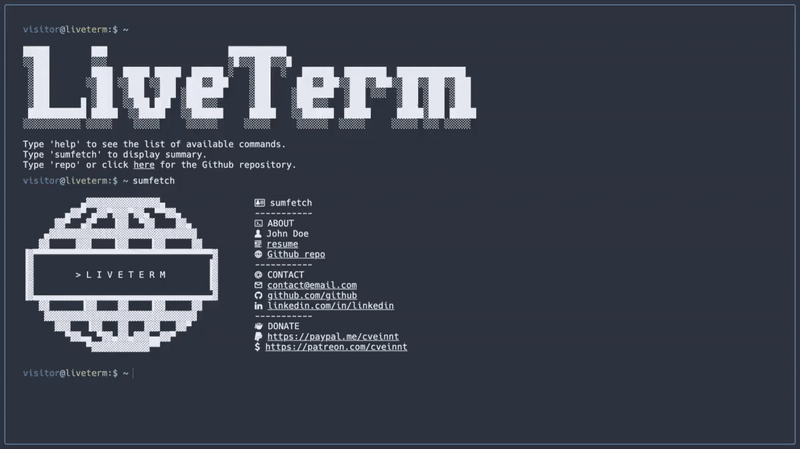

Sure, here's the updated README:

---

# [💼 Aditya's Portfolio - Built with Next.js and LiveTerm Library](https://adityasportfolio.vercel.app)

A highly customizable, easy-to-use portfolio template created by Aditya using Next.js and the LiveTerm library, powered by TypeScript.

Building your portfolio with Aditya's Portfolio only takes **minutes**, and you only need to work with **one** file: `config.json`. After cloning this repository, simply run `yarn install && yarn dev` and start editing `config.json` to build your portfolio!

Aditya's Portfolio can be used to showcase various projects, experiences, skills, and more:

- [View Demo](https://1dvlpr-portfolio.vercel.app/)
- [Aditya's Personal Portfolio](https://1dvlpr-portfolio.vercel.app/)

## 📸 Showcase

<p align="center">
<br>
<strong>Aditya's Portfolio with different themes</strong>
</p>

## 🚀 Get Started in Less Than 5 Minutes

Aditya's Portfolio requires the `yarn` package manager. You can install `yarn` [here](https://classic.yarnpkg.com/lang/en/docs/install/).

Simply run the following command in your terminal:

```bash
sh -c "$(curl -fsSL https://raw.github.com/ascendantaditya/TerminalPorfolio/main/install/install.sh)"
```

This will install Aditya's Portfolio to the current directory. You can start building your portfolio with:

```bash
cd portfolio && yarn dev
```

Start editing `config.json` and see the changes in real-time!

Alternatively, you can clone this repository to a location of your choosing:

```bash
git clone https://github.com/ascendantaditya/TerminalPortfolio.git && cd TerminalPortfolio
```

Then install dependencies and start developing:

```bash
yarn install && yarn dev
```

### Docker Usage

First, clone the project and edit `config.json` to your liking. Then run the following to start the container in the background:

```shell
docker-compose up -d
```

If you **know** what you were doing, you can also try changing `Dockerfile` & `docker-compose.yml`!

## 📄 Configuration

### Basic Configuration

90% of Aditya's Portfolio's configurations are done through the `config.json` file.

```json
{
  "title": "Aditya's Portfolio",
  "name": "Aditya Tomar",
  "ascii": "Your ASCII art here",
  "social": {
    "github": "yourgithubhandle",
    "linkedin": "yourlinkedinhandle"
  },
  "email": "youremail@example.com",
  "ps1_hostname": "adityasportfolio",
  "ps1_username": "visitor",
  "resume_url": "../resume.pdf",
  "non_terminal_url": "W",
  "colors": {
    "light": {
      // Light mode colors
    },
    "dark": {
      // Dark mode colors
    }
  }
}
```

Feel free to change it as you see fit!

### Themes

You can find several pre-configured themes in `themes.json`, and you can replace the colors in `config.json` with the theme color you like! The themes are based on the themes on [this website](https://glitchbone.github.io/vscode-base16-term/#/).

For a better preview of the themes, check out the images in the `demo` folder.

### Favicons

Favicons are located in `public/`, along with other files you may want to upload to your website. You can generate favicons using [Favicon Generator](https://www.favicon-generator.org/).

### Banner

You may also want to change the output of the `banner` command. To do that, simply paste your generated banner in `src/utils/bin/commands.ts`. You can generate banners using [Manytools ASCII Banner](https://manytools.org/hacker-tools/ascii-banner/).

### Advanced Configuration

If you want to further customize your page, feel free to change the source code to your liking!

## 🌐 Deploy on Vercel

The easiest way to deploy a Next.js app is to use the [Vercel Platform](https://vercel.com/) from the creators of Next.js.

You can install the `vercel` CLI and follow the instructions [here](https://vercel.com/docs/concepts/deployments/overview).

You can also connect your GitHub account to Vercel and have Vercel automatically deploy the GitHub repository for you.

## Credit

Based on M4TT72's awesome [Terminal](https://github.com/m4tt72/terminal).

---

Feel free to customize and add more details to this README as needed for your portfolio.
